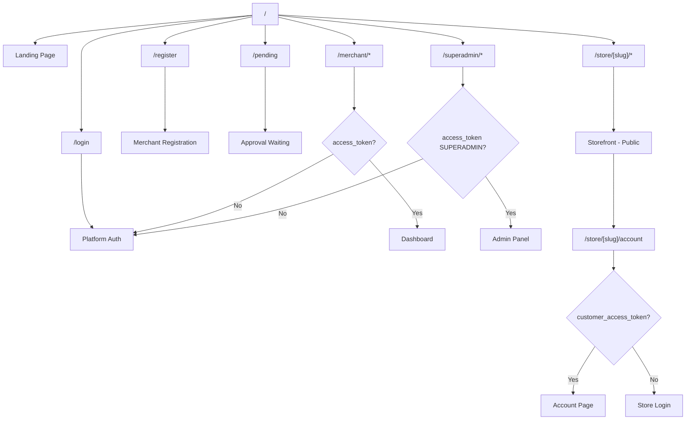
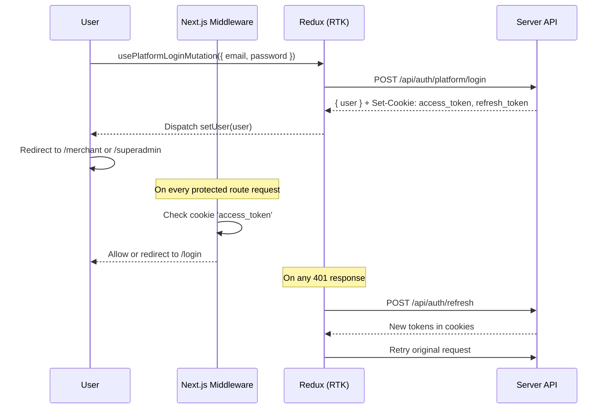

# 📱 Tarmeez Client — توثيق شامل للواجهة الأمامية

> **Version:** 1.0.0 | **Created:** 2026-03-16 | **Framework:** Next.js 16+ / React 19+

---

## 📋 Table of Contents

1. [Project Overview](#1-project-overview)
2. [Project Structure](#2-project-structure)
3. [Routing Architecture](#3-routing-architecture)
4. [Pages Inventory](#4-pages-inventory)
5. [Components Reference](#5-components-reference)
6. [State Management](#6-state-management)
7. [API Integration](#7-api-integration)
8. [Authentication Flow](#8-authentication-flow)
9. [Analytics Frontend](#9-analytics-frontend)
10. [Tracking Script](#10-tracking-script)
11. [Configuration](#11-configuration)
12. [Dependencies](#12-dependencies)
13. [Theming & Styling](#13-theming--styling)
14. [Feature List](#14-feature-list)

---

## 1. Project Overview

Tarmeez Client is a **multi-tenant SaaS store-builder** frontend. It serves three distinct user contexts simultaneously:

| Context | Path Prefix | Description |
|---------|-------------|-------------|
| **Landing** | `/` | Public marketing page |
| **Merchant Dashboard** | `/merchant/*` | Store management panel |
| **Superadmin Panel** | `/superadmin/*` | Platform administration |
| **Storefront** | `/store/[storeSlug]/*` | Customer-facing store |

The app is built in **Arabic (RTL)** with `dir="rtl"` set on `<html>`, using the **Cairo** font family.

---

## 2. Project Structure

```
client/
├── app/                          # Next.js App Router pages
│   ├── layout.tsx                # Root layout: theme, redux, RTL, fonts
│   ├── page.tsx                  # Landing page (/)
│   ├── globals.css               # Global CSS + Tailwind + CSS variables
│   │
│   ├── (auth)/                   # Platform auth routes (login/register)
│   │   ├── layout.tsx            # Auth layout wrapper
│   │   ├── login/page.tsx        # /login — merchant/admin login
│   │   ├── register/page.tsx     # /register — merchant registration
│   │   └── pending/page.tsx      # /pending — awaiting approval
│   │
│   ├── merchant/                 # Merchant dashboard routes (protected)
│   │   ├── layout.tsx            # Sidebar layout for merchant
│   │   ├── page.tsx              # /merchant — Dashboard overview
│   │   ├── analytics/page.tsx    # /merchant/analytics
│   │   ├── products/
│   │   │   ├── page.tsx          # Product list
│   │   │   ├── new/page.tsx      # Create product
│   │   │   └── [id]/page.tsx     # Edit product
│   │   ├── orders/
│   │   │   ├── page.tsx          # Orders list
│   │   │   └── [id]/page.tsx     # Order detail
│   │   ├── customers/
│   │   │   ├── page.tsx          # Customer list
│   │   │   └── [id]/page.tsx     # Customer profile
│   │   ├── categories/page.tsx   # Category management
│   │   ├── settings/page.tsx     # Store settings & customization
│   │   ├── themes/page.tsx       # Theme configuration
│   │   ├── pages/
│   │   │   ├── page.tsx          # Custom pages list
│   │   │   └── [id]/edit/page.tsx # Page editor
│   │   ├── page-builder/page.tsx # Visual page builder (Puck)
│   │   ├── marketing/
│   │   │   ├── page.tsx          # Marketing hub
│   │   │   ├── coupons/page.tsx  # Coupon management
│   │   │   └── abandoned-cart/page.tsx
│   │   ├── billing/page.tsx      # Billing & subscription
│   │   ├── support/page.tsx      # Support tickets
│   │   ├── team/page.tsx         # Team members
│   │   └── apps/page.tsx         # App marketplace
│   │
│   ├── store/[storeSlug]/        # Public storefront (dynamic)
│   │   └── (store)/
│   │       ├── layout.tsx        # Storefront layout with tracker injection
│   │       ├── loading.tsx       # Loading skeleton
│   │       ├── error.tsx         # Error boundary
│   │       ├── page.tsx          # Store homepage
│   │       ├── products/page.tsx # Products catalog
│   │       ├── product/[productSlug]/page.tsx  # Product detail
│   │       ├── cart/page.tsx     # Shopping cart
│   │       ├── login/page.tsx    # Customer login
│   │       ├── register/page.tsx # Customer registration
│   │       ├── account/page.tsx  # Customer account (protected)
│   │       ├── p/[pageSlug]/page.tsx # Custom store pages
│   │       └── (checkout)/
│   │           ├── layout.tsx    # Checkout flow layout
│   │           ├── checkout/page.tsx    # Checkout form
│   │           ├── order-success/page.tsx # Success confirmation
│   │           └── track/page.tsx # Order tracking
│   │
│   └── superadmin/               # Superadmin panel (protected)
│       ├── layout.tsx
│       ├── page.tsx              # Superadmin dashboard
│       ├── merchants/page.tsx    # Merchant management
│       ├── stores/page.tsx       # Store management
│       ├── plans/page.tsx        # Subscription plans
│       ├── revenue/page.tsx      # Platform revenue
│       ├── themes/page.tsx       # Theme marketplace
│       ├── apps/page.tsx         # App marketplace management
│       ├── logs/page.tsx         # System logs
│       ├── tickets/page.tsx      # Support tickets
│       └── settings/page.tsx     # Platform settings
│
├── components/
│   ├── ui/                       # shadcn/ui primitive components
│   ├── pages/
│   │   ├── auth/                 # Login/Register page components
│   │   ├── merchant/             # Merchant dashboard page components
│   │   │   ├── analytics/        # Analytics sub-components
│   │   │   │   ├── tabs/         # OverviewTab, TrafficTab, SalesTab, etc.
│   │   │   │   ├── ChartSkeleton.tsx
│   │   │   │   ├── EmptyState.tsx
│   │   │   │   ├── ErrorState.tsx
│   │   │   │   ├── formatters.ts
│   │   │   │   ├── PeriodSelector.tsx
│   │   │   │   ├── RealTimePulse.tsx
│   │   │   │   └── StatCard.tsx
│   │   ├── storefront/           # Storefront components
│   │   ├── marketing/            # Landing page sections
│   │   └── superadmin/           # Superadmin page components
│   ├── providers/
│   │   └── StoreProvider.tsx     # Redux Provider wrapper
│   └── theme/
│       └── theme-provider.tsx    # next-themes provider
│
├── lib/
│   ├── store/                    # Redux store
│   │   ├── index.ts              # configureStore
│   │   ├── slices/
│   │   │   ├── authSlice.ts      # User auth state
│   │   │   └── cartSlice.ts      # Shopping cart state
│   │   └── analytics-listener.ts # RTK listener middleware
│   ├── services/                 # RTK Query APIs
│   │   ├── baseQuery.ts          # Base fetch + reauth logic
│   │   ├── authApi.ts
│   │   ├── merchantApi.ts
│   │   ├── productsApi.ts
│   │   ├── ordersApi.ts
│   │   ├── categoriesApi.ts
│   │   ├── pagesApi.ts
│   │   ├── analyticsApi.ts
│   │   ├── reviewsApi.ts
│   │   ├── wishlistApi.ts
│   │   ├── customerApi.ts
│   │   └── superadminApi.ts
│   ├── types/                    # TypeScript type definitions
│   └── utils.ts                  # Shared utilities (cn, etc.)
│
├── hooks/
│   └── use-mobile.ts             # Responsive breakpoint hook
│
├── middleware.ts                 # Next.js route protection middleware
├── next.config.ts                # Next.js configuration
├── tailwind.config.ts            # Tailwind CSS configuration
├── package.json
└── tsconfig.json
```

---

## 3. Routing Architecture

### Route Guards (middleware.ts)

Next.js middleware runs at the Edge before rendering:

```typescript
// client/middleware.ts
export function middleware(request: NextRequest) {
  const { pathname } = request.nextUrl
  const accessToken = request.cookies.get('access_token')

  // حماية مسارات التاجر والمشرف
  if (pathname.startsWith('/merchant') || pathname.startsWith('/superadmin')) {
    if (!accessToken) {
      return NextResponse.redirect(new URL('/login', request.url))
    }
  }

  // حماية صفحة حساب العميل
  if (pathname.includes('/account')) {
    const customerToken = request.cookies.get('customer_access_token')
    if (!customerToken) {
      return NextResponse.redirect(new URL(`/store/${storeSlug}/login`, request.url))
    }
  }
}

export const config = {
  matcher: ['/merchant/:path*', '/superadmin/:path*', '/store/:path*/account/:path*'],
}
```

### Route Map



### Route Groups

| Group | Purpose | Layout |
|-------|---------|--------|
| `(auth)` | Platform auth forms | Minimal centered layout |
| `(store)` | Storefront inner pages | Full store layout with header/footer |
| `(checkout)` | Checkout flow | Stripped checkout layout |

---

## 4. Pages Inventory

### 🌐 Public / Landing Pages

| Page | Path | Component | Description |
|------|------|-----------|-------------|
| Landing | `/` | `app/page.tsx` | Marketing home with hero, features, pricing |
| Login | `/login` | `pages/auth/Login.tsx` | Platform sign-in (merchant + superadmin) |
| Register | `/register` | `pages/auth/Signup.tsx` | Merchant registration form |
| Pending | `/pending` | `(auth)/pending/page.tsx` | "Application under review" status |

### 🏪 Merchant Dashboard Pages

| Page | Path | Description |
|------|------|-------------|
| Dashboard | `/merchant` | KPI overview: orders, revenue, customers |
| Analytics | `/merchant/analytics` | Full analytics dashboard (6 tabs) |
| Products | `/merchant/products` | Product list with status filters |
| New Product | `/merchant/products/new` | Product creation form |
| Edit Product | `/merchant/products/[id]` | Product editor with variants/offers |
| Orders | `/merchant/orders` | Order management table |
| Order Detail | `/merchant/orders/[id]` | Single order with status controls |
| Customers | `/merchant/customers` | Customer list with search/filter |
| Customer Profile | `/merchant/customers/[id]` | Customer details and order history |
| Categories | `/merchant/categories` | Category management |
| Settings | `/merchant/settings` | Store branding, colors, fonts |
| Themes | `/merchant/themes` | Theme selection |
| Pages | `/merchant/pages` | Custom page list |
| Page Editor | `/merchant/pages/[id]/edit` | Rich page editor |
| Page Builder | `/merchant/page-builder` | Visual drag-and-drop builder (Puck) |
| Marketing | `/merchant/marketing` | Marketing tools hub |
| Coupons | `/merchant/marketing/coupons` | Coupon management |
| Abandoned Cart | `/merchant/marketing/abandoned-cart` | Cart recovery tools |
| Billing | `/merchant/billing` | Subscription & billing |
| Support | `/merchant/support` | Support ticket submission |
| Team | `/merchant/team` | Team member management |
| Apps | `/merchant/apps` | Third-party app marketplace |

### 🛒 Storefront Pages

| Page | Path | Auth |
|------|------|------|
| Store Home | `/store/[slug]` | Public |
| Products Catalog | `/store/[slug]/products` | Public |
| Product Detail | `/store/[slug]/product/[productSlug]` | Public |
| Cart | `/store/[slug]/cart` | Public |
| Checkout | `/store/[slug]/checkout` | Public |
| Order Success | `/store/[slug]/order-success` | Public |
| Order Tracking | `/store/[slug]/track` | Public |
| Customer Login | `/store/[slug]/login` | Public |
| Customer Register | `/store/[slug]/register` | Public |
| Account | `/store/[slug]/account` | **Customer token required** |
| Custom Page | `/store/[slug]/p/[pageSlug]` | Public |

### 👑 Superadmin Pages

| Page | Path | Description |
|------|------|-------------|
| Dashboard | `/superadmin` | Platform-wide metrics |
| Merchants | `/superadmin/merchants` | Approve/reject merchants |
| Stores | `/superadmin/stores` | All active stores |
| Plans | `/superadmin/plans` | Subscription plan management |
| Revenue | `/superadmin/revenue` | Platform revenue analytics |
| Themes | `/superadmin/themes` | Theme marketplace management |
| Apps | `/superadmin/apps` | App marketplace management |
| Logs | `/superadmin/logs` | System activity logs |
| Support Tickets | `/superadmin/tickets` | All support tickets |
| Settings | `/superadmin/settings` | Platform configuration |

---

## 5. Components Reference

### UI Primitives (`components/ui/`)

All UI primitives are based on **shadcn/ui** built on Radix UI:

| Component | Description |
|-----------|-------------|
| `accordion.tsx` | Collapsible content panels |
| `alert.tsx` | Notification alerts |
| `alert-dialog.tsx` | Confirmation modal dialogs |
| `avatar.tsx` | User avatar display |
| `badge.tsx` | Status/label badges |
| `breadcrumb.tsx` | Navigation breadcrumbs |
| `button.tsx` | Button with variants (default, outline, ghost, etc.) |
| `calendar.tsx` | Date picker calendar |
| `card.tsx` | Content card container |
| `carousel.tsx` | Image/content carousel |
| `chart.tsx` | **Recharts-based chart wrapper** (key component) |
| `checkbox.tsx` | Checkbox input |
| `dialog.tsx` | Modal dialog |
| `drawer.tsx` | Mobile-friendly slide-over drawer |
| `dropdown-menu.tsx` | Dropdown context menus |
| `form.tsx` | React Hook Form integration |
| `input.tsx` | Text input |
| `label.tsx` | Form label |
| `pagination.tsx` | Table/list pagination |
| `popover.tsx` | Floating content panel |
| `progress.tsx` | Progress bar |
| `select.tsx` | Dropdown select |
| `separator.tsx` | Horizontal/vertical divider |
| `sheet.tsx` | Side panel sheet |
| `sidebar.tsx` | Navigation sidebar |
| `skeleton.tsx` | Loading skeleton placeholder |
| `slider.tsx` | Range slider |
| `sonner.tsx` | Toast notification wrapper |
| `switch.tsx` | Toggle switch |
| `table.tsx` | Data table |
| `tabs.tsx` | Tabbed navigation |
| `textarea.tsx` | Multi-line text input |
| `tooltip.tsx` | Hover tooltips |

### Analytics Components (`components/pages/merchant/analytics/`)

| Component | Props | Purpose |
|-----------|-------|---------|
| `StatCard.tsx` | `title, value, change, icon` | KPI metric card with trend |
| `ChartSkeleton.tsx` | `height?` | Loading placeholder for charts |
| `EmptyState.tsx` | `message?` | No-data illustration |
| `ErrorState.tsx` | `onRetry` | Error display with retry button |
| `PeriodSelector.tsx` | `value, onChange` | Date range picker (1d/7d/30d/90d/1y) |
| `RealTimePulse.tsx` | — | Animated online visitor indicator |
| `formatters.ts` | — | Number formatters (1000→"1,000", 1500000→"1.5M") |

#### Analytics Tabs

| Tab Component | Chart Types | Data Source |
|---------------|-------------|-------------|
| `tabs/OverviewTab.tsx` | StatCards + AreaChart | `getOverview` API |
| `tabs/TrafficTab.tsx` | PieChart (devices) + AreaChart (daily) + PieChart (sources) | `getTraffic` API |
| `tabs/SalesTab.tsx` | AreaChart (revenue) + BarChart (orders) + table (top products) | `getSales` API |
| `tabs/PagesTab.tsx` | BarChart (page views) + table | `getPages` API |
| `tabs/FunnelTab.tsx` | Horizontal BarChart (funnel steps) | `getFunnel` API |
| `tabs/HeatmapTab.tsx` | Canvas overlay heatmap | `getHeatmap` API |

### Merchant Dashboard Components

| Component | Path | Description |
|-----------|------|-------------|
| `Dashboard.tsx` | `pages/merchant/Dashboard.tsx` | Main KPI dashboard |
| `Analytics.tsx` | `pages/merchant/Analytics.tsx` | Analytics page wrapper |
| `Products.tsx` | `pages/merchant/Products.tsx` | Product list view |
| `ProductEditor.tsx` | `pages/merchant/ProductEditor.tsx` | Create/edit product form |
| `Orders.tsx` | `pages/merchant/Orders.tsx` | Orders table |
| `OrderDetails.tsx` | `pages/merchant/OrderDetails.tsx` | Single order view |
| `Customers.tsx` | `pages/merchant/Customers.tsx` | Customers table with search |
| `CustomerProfile.tsx` | `pages/merchant/CustomerProfile.tsx` | Detailed customer page |
| `Categories.tsx` | `pages/merchant/Categories.tsx` | Category CRUD |
| `Settings.tsx` | `pages/merchant/Settings.tsx` | Store customization panel |
| `Themes.tsx` | `pages/merchant/Themes.tsx` | Theme browser/selector |
| `Pages.tsx` | `pages/merchant/Pages.tsx` | Custom pages management |
| `PageBuilder.tsx` | `pages/merchant/PageBuilder.tsx` | Puck visual editor |
| `Marketing.tsx` | `pages/merchant/Marketing.tsx` | Marketing tools |
| `Coupons.tsx` | `pages/merchant/Coupons.tsx` | Coupon CRUD |
| `AbandonedCart.tsx` | `pages/merchant/AbandonedCart.tsx` | Abandoned cart recovery |
| `Billing.tsx` | `pages/merchant/Billing.tsx` | Billing & plan info |
| `Support.tsx` | `pages/merchant/Support.tsx` | Support ticket form |
| `Team.tsx` | `pages/merchant/Team.tsx` | Team management |
| `Apps.tsx` | `pages/merchant/Apps.tsx` | App marketplace |
| `MerchantLayout.tsx` | `pages/merchant/MerchantLayout.tsx` | Sidebar + header wrapper |

### Navigation Components

| Component | Description |
|-----------|-------------|
| `app-sidebar.tsx` | Main collapsible sidebar with nav sections |
| `nav-main.tsx` | Primary navigation links group |
| `nav-secondary.tsx` | Secondary navigation group |
| `nav-projects.tsx` | Projects/stores navigation section |
| `nav-user.tsx` | User avatar + logout dropdown |
| `team-switcher.tsx` | Store/team switcher in sidebar header |
| `mode-toggle.tsx` | Light/dark mode toggle button |

### Layout Providers

| Component | Path | Purpose |
|-----------|------|---------|
| `StoreProvider` | `components/providers/StoreProvider.tsx` | Redux `Provider` wrapper |
| `ThemeProvider` | `components/theme/theme-provider.tsx` | `next-themes` dark/light mode |

### Landing Page Sections

| Component | Purpose |
|-----------|---------|
| `header.tsx` | Marketing site navigation header |
| `hero-section.tsx` | Hero banner with CTA |
| `features-section.tsx` | Feature highlights grid |
| `multi-store-features.tsx` | Multi-store capabilities section |
| `process-steps.tsx` | How-it-works steps |
| `pricing.tsx` | Pricing plans comparison |
| `call-to-action.tsx` | Bottom CTA section |
| `footer-section.tsx` | Site footer |

---

## 6. State Management

### Redux Store Structure

```typescript
// lib/store/index.ts
store = {
  auth: AuthState,           // Current user + initialization status
  cart: CartState,           // Shopping cart items
  authApi: RTKQueryState,    // Auth API cache
  merchantApi: RTKQueryState,
  productsApi: RTKQueryState,
  ordersApi: RTKQueryState,
  analyticsApi: RTKQueryState,
  reviewsApi: RTKQueryState,
  wishlistApi: RTKQueryState,
  categoriesApi: RTKQueryState,
  pagesApi: RTKQueryState,
  superadminApi: RTKQueryState,
  customerApi: RTKQueryState,
}
```

### Auth Slice (`lib/store/slices/authSlice.ts`)

```typescript
interface AuthState {
  user: CurrentUser | null  // المستخدم الحالي
  isLoading: boolean        // حالة التحميل
  isInitialized: boolean    // هل تم تحميل البيانات الأولية
}

// Actions:
setUser(user: CurrentUser | null)  // تعيين المستخدم
clearUser()                        // مسح بيانات المستخدم
setInitialized(value: boolean)     // تعيين حالة التهيئة
```

### Cart Slice (`lib/store/slices/cartSlice.ts`)

Manages the storefront shopping cart state (items, quantities, totals).

### Analytics Listener Middleware (`lib/store/analytics-listener.ts`)

RTK listener middleware that hooks into cart actions to fire analytics events (cart add/remove/abandon) via the tracking script.

---

## 7. API Integration

### Base Configuration

```typescript
// lib/services/baseQuery.ts
const baseUrl = process.env.NEXT_PUBLIC_API_URL || 'http://localhost:8000/api'

// All requests use credentials: 'include' for cookie-based authentication
const baseQuery = fetchBaseQuery({ baseUrl, credentials: 'include' })
```

### Automatic Token Refresh

The `baseQueryWithReauth` wrapper automatically handles 401 responses by calling `/auth/refresh` and retrying the original request:

```typescript
// جلب تلقائي للتوكن عند انتهاء صلاحيته
if (result.error?.status === 401) {
  const refreshResult = await baseQuery({ url: '/auth/refresh', method: 'POST' }, ...)
  if (refreshResult.data) {
    result = await baseQuery(args, ...)  // إعادة المحاولة
  } else {
    api.dispatch(clearUser())  // تسجيل الخروج عند الفشل
  }
}
```

### RTK Query APIs

#### `authApi` — Authentication

| Hook | Method | Endpoint | Description |
|------|--------|----------|-------------|
| `usePlatformLoginMutation` | POST | `/auth/platform/login` | تسجيل دخول التاجر/المشرف |
| `useMerchantRegisterMutation` | POST | `/auth/platform/register` | تسجيل تاجر جديد |
| `useCustomerLoginMutation` | POST | `/auth/customer/login` | تسجيل دخول العميل |
| `useCustomerRegisterMutation` | POST | `/auth/customer/register` | تسجيل عميل جديد |
| `useGetMeQuery` | GET | `/auth/me` | جلب بيانات المستخدم الحالي |
| `useLogoutMutation` | POST | `/auth/logout` | تسجيل الخروج |

#### `merchantApi` — Merchant Management

| Hook | Method | Endpoint | Description |
|------|--------|----------|-------------|
| `useGetMyStoreQuery` | GET | `/merchant/me` | بيانات المتجر الحالي |
| `useGetPaymentSettingsQuery` | GET | `/merchant/store/payment-methods` | إعدادات الدفع |
| `useUpdatePaymentSettingsMutation` | PATCH | `/merchant/store/payment-methods` | تحديث طرق الدفع |
| `useGetOrdersQuery` | GET | `/merchant/orders` | قائمة الطلبات |
| `useGetOrderByCodeQuery` | GET | `/merchant/orders/:code` | تفاصيل طلب |
| `useUpdateOrderStatusMutation` | PATCH | `/merchant/orders/:code/status` | تحديث حالة طلب |
| `useGetCustomersQuery` | GET | `/merchant/customers` | قائمة العملاء |
| `useUpdateCustomerStatusMutation` | PATCH | `/merchant/customers/:id/status` | تعديل حالة عميل |

#### `analyticsApi` — Analytics

| Hook | Endpoint | Default Period | Description |
|------|----------|----------------|-------------|
| `useGetOverviewQuery` | `/merchant/analytics/overview` | `7d` | نظرة عامة |
| `useGetTrafficQuery` | `/merchant/analytics/traffic` | `7d` | مصادر الزيارات |
| `useGetPagesQuery` | `/merchant/analytics/pages` | `7d` | أداء الصفحات |
| `useGetFunnelQuery` | `/merchant/analytics/funnel` | `7d` | قمع التحويل |
| `useGetSalesQuery` | `/merchant/analytics/sales` | `30d` | تحليل المبيعات |
| `useGetHeatmapQuery` | `/merchant/analytics/heatmap` | — | خريطة الحرارة |

**Polling:** All analytics queries poll every **60 seconds**.

#### `productsApi` — Products

| Hook | Method | Endpoint |
|------|--------|----------|
| `useGetProductsQuery` | GET | `/merchant/products` |
| `useGetProductByIdQuery` | GET | `/merchant/products/:id` |
| `useCreateProductMutation` | POST | `/merchant/products` |
| `useUpdateProductMutation` | PATCH | `/merchant/products/:id` |
| `useDeleteProductMutation` | DELETE | `/merchant/products/:id` |

#### `ordersApi` — Orders (Storefront)

| Hook | Method | Endpoint |
|------|--------|----------|
| `useCreateOrderMutation` | POST | `/orders` |
| `useGetOrderByCodeQuery` | GET | `/orders/:code` |

#### Other APIs

| API | Handles |
|-----|---------|
| `categoriesApi` | Category CRUD for merchant |
| `pagesApi` | Custom page management |
| `reviewsApi` | Product reviews (storefront) |
| `wishlistApi` | Customer wishlist |
| `customerApi` | Customer profile, addresses |
| `superadminApi` | Merchant approval, platform settings |

---

## 8. Authentication Flow

### Platform Auth Flow (Merchant / Superadmin)



### Customer Auth Flow (Storefront)

Customers authenticate per-store. Tokens are stored in separate cookies (`customer_access_token`, `customer_refresh_token`) to avoid conflicts with platform auth.

```typescript
// تسجيل دخول العميل لمتجر محدد
POST /api/auth/customer/login
Body: { email, password, storeSlug }
Response: Sets customer_access_token + customer_refresh_token cookies
```

### Cookie Configuration

| Cookie | Scope | Duration | HttpOnly |
|--------|-------|----------|----------|
| `access_token` | Platform (merchant/admin) | Short (15min) | Yes |
| `refresh_token` | Platform | Long (7d) | Yes |
| `customer_access_token` | Storefront | Short (15min) | Yes |
| `customer_refresh_token` | Storefront | Long (7d) | Yes |

### Role-Based UI

After `getMe` resolves, the Redux `auth.user.role` field determines rendering:

```typescript
// Roles: SUPERADMIN | MERCHANT | CUSTOMER
if (user.role === 'MERCHANT' && user.merchant?.status === 'PENDING') {
  // Redirect to /pending
}
if (user.role === 'SUPERADMIN') {
  // Show admin navigation
}
```

---

## 9. Analytics Frontend

The analytics dashboard lives at `/merchant/analytics` and is implemented as a **6-tab interface**:

### Tab Architecture

```
Analytics.tsx (main page)
├── PeriodSelector       — date range selector (1d/7d/30d/90d/1y/all)
├── RealTimePulse        — animated live visitor dot
│
├── Tab: Overview        — OverviewTab.tsx
│   ├── StatCard × 4    (visitors, pageViews, revenue, conversionRate)
│   └── AreaChart       (daily visitors + page views trend)
│
├── Tab: Traffic         — TrafficTab.tsx
│   ├── PieChart        (device breakdown: mobile/tablet/desktop)
│   ├── PieChart        (traffic sources: organic/social/direct/referral)
│   ├── AreaChart       (daily traffic)
│   └── Table           (top countries)
│
├── Tab: Sales           — SalesTab.tsx
│   ├── AreaChart       (revenue over time)
│   ├── BarChart        (orders per day)
│   └── HorizontalBar   (top products by revenue)
│
├── Tab: Pages           — PagesTab.tsx
│   ├── BarChart        (page views per page)
│   └── Table           (slug, views, avgDuration, bounceRate)
│
├── Tab: Funnel          — FunnelTab.tsx
│   └── HorizontalBar   (visitors → product view → cart → checkout → purchase)
│
└── Tab: Heatmap         — HeatmapTab.tsx
    └── Canvas overlay  (click/move/scroll density map)
```

### Chart Standards

```typescript
// جميع الألوان من متغيرات CSS الخاصة بالمخططات
const colors = {
  primary: 'var(--color-chart-1)',
  secondary: 'var(--color-chart-2)',
  accent: 'var(--color-chart-3)',
  neutral: 'var(--color-chart-4)',
  muted: 'var(--color-chart-5)',
}

// تنسيق الأرقام
formatters.number(1500000) // → "1.5M"
formatters.number(15000)   // → "15,000"
formatters.currency(1234)  // → "1,234 ر.س"
```

### States: Every Chart

Each chart implements three mandatory states:

1. **Loading** → `<ChartSkeleton />` (animated pulse)
2. **Empty** → `<EmptyState />` (illustration + message)
3. **Error** → `<ErrorState onRetry={...} />` (retry button)

---

## 10. Tracking Script

The tracking script (`public/tarmeez-tracker.js`) is injected into every storefront page.

### Injection

```tsx
// Storefront layout injects the tracker
<Script
  src="/tarmeez-tracker.js"
  strategy="afterInteractive"
  data-store-id={store.id}
  data-endpoint="/api/analytics/collect"
/>
```

### Script Behavior

| Event | Trigger | Throttle | Data Sent |
|-------|---------|----------|-----------|
| `pageview` | On load | — | page, referrer domain, device, browser |
| `click` | Every click | — | page, x%, y%, device |
| `move` | Mouse move | **100ms** | page, x%, y% |
| `scroll` | Scroll depth | **500ms** | page, depth% (sent on unload) |

### Key Constraints

- ✅ Uses `navigator.sendBeacon` with `application/json` Blob (never `fetch`)
- ✅ Session ID stored in `sessionStorage` only (no cookies, no localStorage)
- ✅ Session ID is 32-char hex UUID, generated with `crypto.getRandomValues`
- ✅ All errors caught silently — never throws to console
- ✅ < 5KB minified
- ✅ No external dependencies (vanilla JS only)

---

## 11. Configuration

### Environment Variables

```bash
# .env.local (client)
NEXT_PUBLIC_API_URL=http://localhost:8000/api
```

### next.config.ts

```typescript
const nextConfig: NextConfig = {
  images: {
    remotePatterns: [
      { protocol: 'https', hostname: 'ik.imagekit.io' },    // ImageKit CDN
      { protocol: 'https', hostname: 'placehold.co' },       // Placeholder images
      { protocol: 'http',  hostname: 'localhost:8000' },     // Local server uploads
    ],
  },
}
```

### Fonts

Three fonts are loaded via `next/font/google`:

| Variable | Font | Subsets |
|----------|------|---------|
| `--font-geist-sans` | Geist Sans | latin |
| `--font-geist-mono` | Geist Mono | latin |
| `--font-cairo` | Cairo | latin + arabic |

The `<html>` element uses `lang="ar" dir="rtl"` for proper RTL Arabic layout.

---

## 12. Dependencies

### Core Framework

| Package | Version | Purpose |
|---------|---------|---------|
| `next` | 16.1.5 | React full-stack framework |
| `react` | 19.2.3 | UI library |
| `react-dom` | 19.2.3 | DOM renderer |
| `typescript` | ^5 | Type safety |

### State Management

| Package | Version | Purpose |
|---------|---------|---------|
| `@reduxjs/toolkit` | ^2.11.2 | Redux store + RTK Query |
| `react-redux` | ^9.2.0 | React Redux bindings |

### UI & Styling

| Package | Purpose |
|---------|---------|
| `tailwindcss` | ^4 | Utility-first CSS |
| `tailwindcss-rtl` | RTL support plugin for Tailwind |
| `recharts` | Chart library (used via shadcn `chart.tsx`) |
| `lucide-react` | SVG icon library |
| `@tabler/icons-react` | Additional icon set |
| `next-themes` | Dark/light mode management |
| `sonner` | Toast notifications |

### Radix UI Primitives (via shadcn/ui)

| Package | Primitive |
|---------|-----------|
| `@radix-ui/react-accordion` | Accordion |
| `@radix-ui/react-alert-dialog` | Alert Dialog |
| `@radix-ui/react-dialog` | Dialog |
| `@radix-ui/react-popover` | Popover |
| `@radix-ui/react-select` | Select |
| `@radix-ui/react-slider` | Slider |
| `@radix-ui/react-switch` | Switch |
| `@radix-ui/react-tabs` | Tabs |
| `@radix-ui/react-tooltip` | Tooltip |

### Forms & Validation

| Package | Purpose |
|---------|---------|
| `react-hook-form` | Form state management |
| `@hookform/resolvers` | Zod integration |
| `zod` | Schema validation |

### Drag & Drop

| Package | Purpose |
|---------|---------|
| `@dnd-kit/core` | Drag-and-drop primitives |
| `@dnd-kit/sortable` | Sortable lists |
| `@puckeditor/core` | Visual page builder |

### Utilities

| Package | Purpose |
|---------|---------|
| `clsx` | Conditional class names |
| `tailwind-merge` | Tailwind class merging |
| `class-variance-authority` | Component variant management |
| `motion` | Animation library (Framer Motion v12) |
| `@tanstack/react-table` | Headless table management |
| `lenis` | Smooth scroll |

---

## 13. Theming & Styling

### CSS Variables (globals.css)

The app uses semantic CSS variables for consistent theming:

```css
/* Chart colors (ANALYTICS-RULE 8) */
--color-chart-1: hsl(...);
--color-chart-2: hsl(...);
--color-chart-3: hsl(...);
--color-chart-4: hsl(...);
--color-chart-5: hsl(...);

/* Semantic design tokens */
--background: ...;
--foreground: ...;
--primary: ...;
--secondary: ...;
--accent: ...;
--muted: ...;
--border: ...;
--radius: ...;
```

### Dark Mode

Managed by `next-themes` with `attribute="class"`. The `ThemeProvider` wraps the entire app:

```tsx
<ThemeProvider attribute="class" defaultTheme="system" enableSystem>
```

### RTL Layout

- `<html lang="ar" dir="rtl">` set in root layout
- `tailwindcss-rtl` plugin for logical RTL utilities
- All directional styles use RTL-aware Tailwind classes

---

## 14. Feature List

| # | Feature | Status | Notes |
|---|---------|--------|-------|
| 1 | Multi-tenant store system | ✅ | Each store has unique slug |
| 2 | Merchant dashboard | ✅ | Full CRUD management |
| 3 | Analytics (6 views) | ✅ | Overview, Traffic, Sales, Pages, Funnel, Heatmap |
| 4 | Visitor tracking script | ✅ | < 5KB, sendBeacon, anonymous |
| 5 | Visual page builder (Puck) | ✅ | Drag-and-drop editor |
| 6 | Product management | ✅ | Variants, options, offers, SEO |
| 7 | Order management | ✅ | Status tracking, full detail view |
| 8 | Customer management | ✅ | Profiles, BANNED/ACTIVE status |
| 9 | Dark mode | ✅ | System-aware + manual toggle |
| 10 | RTL Arabic UI | ✅ | Full RTL support |
| 11 | Storefront with checkout | ✅ | Cart, checkout, order tracking |
| 12 | Customer auth per store | ✅ | Separate cookie tokens |
| 13 | Superadmin panel | ✅ | Merchant approval workflow |
| 14 | Marketing tools | 🔄 | Coupons + abandoned cart (UI ready) |
| 15 | Coupon management | 🔄 | UI created, backend integration pending |
| 16 | RTK Query polling | ✅ | 60-second interval for analytics |
| 17 | Auto token refresh | ✅ | Transparent re-authentication |
| 18 | Category management | ✅ | Nested categories with images |
| 19 | Reviews system | ✅ | Customer reviews with ratings |
| 20 | Wishlist | ✅ | Customer product wishlist |
